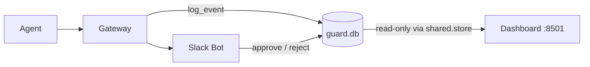

# Dashboard planning flow

Source: [Dashboard plan.md](dashboard/Dashboard%20plan.md)

## System overview

```mermaid
flowchart LR
  A[Agent] --> B[Gateway]
  B --> C[Slack Bot]
  B -- log_event --> DB[(guard.db)]
  C -- approve / reject --> DB
  DB -- read-only via shared.store --> D[Dashboard :8501]
```

## Full planning flow

```mermaid
flowchart TD

    %% ---------------- Context ----------------
    subgraph CTX["0. Context"]
        C1["Person 4 task 2: live log dashboard<br/>(after the Slack bot)"]
        C2["Spec: README §2, §4, §5.4, §8 step 7, §9, §10"]
        C3["Streamlit, separate process<br/>port 8501 (onboarding keeps 8000)"]
        C1 --> C2 --> C3
    end

    %% ---------------- Step 1: Setup ----------------
    subgraph S1["1. Setup"]
        S1a["Dependencies: streamlit >= 1.37, pandas"]
        S1b["Run from repo root:<br/>streamlit run dashboard/app.py --server.port 8501"]
        S1c["app.py adds repo root to sys.path<br/>then imports shared.store, shared.policy"]
        S1d["Read-only: no writes, no raw SQL<br/>GUARD_DB honored via store.DB_PATH"]
        S1a --> S1b --> S1c --> S1d
    end

    %% ---------------- Step 2: Design ----------------
    subgraph S2["2. Design"]
        direction TB

        subgraph FILES["Files"]
            F1["dashboard/__init__.py"]
            F2["dashboard/app.py<br/>UI"]
            F3["dashboard/data.py<br/>pure functions: rows to DataFrame,<br/>counters, colors"]
            F4["dashboard/seed_demo.py<br/>fake data"]
        end

        subgraph SRC["Data sources (reuse shared/*)"]
            D1["store.recent_events(limit)<br/>newest first"]
            D2["store.pending_approvals()"]
            D3["store.daily_payment_total()"]
            D4["policy.load_policy()<br/>daily limit + business name"]
            D5["Amount: amount_usd<br/>fallback facts.amount, recipients from facts"]
        end

        subgraph UI["Layout (top to bottom)"]
            U0["Sidebar: decision filter, row count, Pause toggle"]
            U1["Title: AgentGuard · business<br/>Live / Paused + updated time"]
            U2["Counters (today):<br/>✅ Automatic + % · 🚫 Blocked ·<br/>🟡 Reached owner + breakdown · 💵 Today $ / limit"]
            U3["⏳ Pending panel:<br/>one line per approval, seconds left = 60 - age"]
            U4["🚫 Toast on new blocked event<br/>(last_seen_id in session_state)"]
            U5["Events table, rows colored by outcome<br/>🔴 for DESTRUCTIVE reasons"]
            U6["Details: pick event id,<br/>show pretty args_json + full reason"]
            U0 --> U1 --> U2 --> U3 --> U4 --> U5 --> U6
        end

        subgraph COLORS["Row colors"]
            K1["🟩 forwarded"]
            K2["🟥 blocked"]
            K3["🟨 pending ask"]
            K4["🟦 approved"]
            K5["⬜ rejected / timeout"]
            K6["🟫 error"]
        end

        FILES --> SRC --> UI
        U5 -.-> COLORS
    end

    %% ---------------- Runtime refresh loop ----------------
    subgraph LOOP["Live refresh: st.fragment(run_every=2s)"]
        L0{"Paused?"}
        L1["Read events, pending, spent<br/>via shared.store"]
        L2{"DB read OK?"}
        L3["Show error, retry next tick"]
        L4["Render counters, pending panel,<br/>toasts, table"]
        L5["Wait 2s"]
        L6["Stop auto-refresh<br/>(page stays as is)"]
        L0 -- no --> L1 --> L2
        L2 -- no --> L3 --> L5
        L2 -- yes --> L4 --> L5 --> L0
        L0 -- yes --> L6
    end

    %% ---------------- Edge cases ----------------
    subgraph EDGE["Edge cases"]
        E1["Empty / missing guard.db:<br/>store.connect creates tables,<br/>show 'No agent activity yet'"]
        E2["Busy day: recent_events(500) may undercount<br/>later: ask Person 1 for store.events_since(day)"]
        E3["No facts_json or bad JSON args:<br/>show raw text, never crash"]
        E4["policy.json missing / no limit:<br/>show spent without '/ limit'"]
    end

    %% ---------------- Extras ----------------
    subgraph EXTRA["Extras (only after must-haves)"]
        X1["Red-team score card<br/>(format agreed with Person 2)"]
        X2["Bypass-detector alerts list"]
        X3["'Learning' suggestion card<br/>links to Person 3 flow"]
    end

    %% ---------------- Verification ----------------
    subgraph VER["Verification"]
        V1["1. Unit check data.py<br/>fake event dicts: counts + colors"]
        V2["2. Seed demo.db with seed_demo.py (~15 events)<br/>run dashboard on GUARD_DB=demo.db"]
        V3["3. Live update: re-run seed / live_test.py<br/>new rows + Blocked toast within ~2s, no flicker"]
        V4["4. With Slack: pending shows in panel,<br/>Approve in Slack, row turns blue, leaves panel"]
        V5["5. Delete demo.db<br/>never seed the real guard.db"]
        V1 --> V2 --> V3 --> V4 --> V5
    end

    %% ---------------- Overall flow ----------------
    CTX --> S1 --> S2 --> LOOP
    LOOP --> EDGE
    EDGE --> VER
    VER --> DONE(["✅ Must-haves done"])
    DONE --> EXTRA

    %% ---------------- Styling ----------------
    classDef ok fill:#e6f4ea,stroke:#34a853,color:#000
    classDef bad fill:#fce8e6,stroke:#ea4335,color:#000
    classDef wait fill:#fef7e0,stroke:#f9ab00,color:#000
    classDef info fill:#e8f0fe,stroke:#4285f4,color:#000
    classDef gray fill:#f1f3f4,stroke:#9aa0a6,color:#000
    classDef err fill:#f4c7c3,stroke:#a50e0e,color:#000

    class K1,DONE ok
    class K2,L3 bad
    class K3,U3 wait
    class K4 info
    class K5 gray
    class K6 err
```
